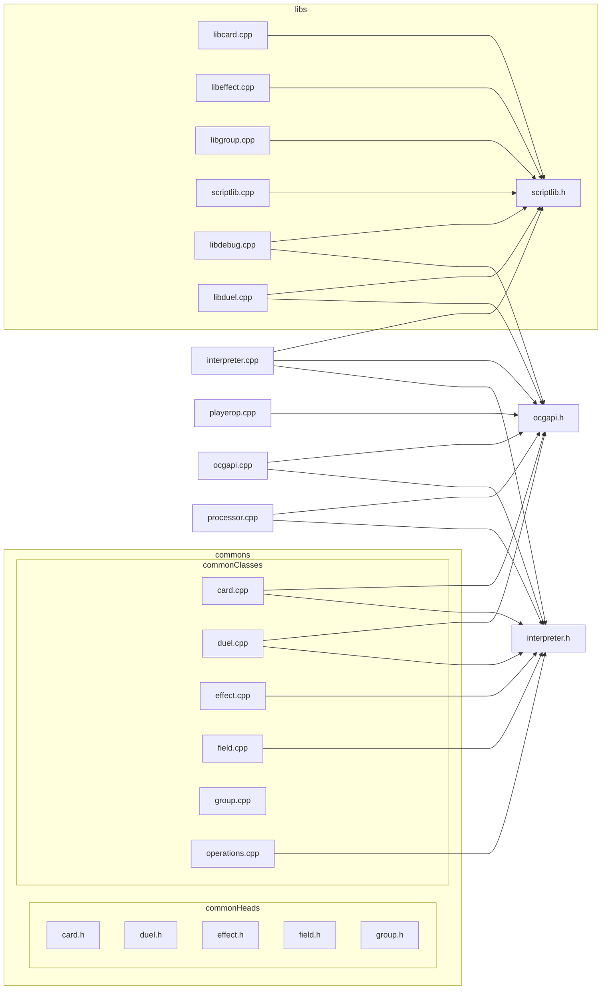

# About ocgcore

## File Dependencies of YGOCore

### Head Dependencies

```mermaid
flowchart LR

scriptlib.h{{scriptlib.h}}
interpreter.h{{interpreter.h}}
ocgapi.h{{ocgapi.h}}

card.h([card.h])
duel.h([duel.h])
effect.h([effect.h])
field.h([field.h])
group.h([group.h])

card.h ---> common.h
card.h ---> effectset.h
duel.h ---> common.h

effect.h ---> common.h
effect.h ---> effectset.h
effect.h ---> field.h

field.h ---> card.h
field.h ---> common.h
field.h ---> effectset.h

group.h ---> common.h

%% interpreter.h ---> lua.h
%% interpreter.h ---> lauxlib.h
%% interpreter.h ---> lualib.h
interpreter.h ---> common.h

ocgapi.h ---> common.h

scriptlib.h ---> common.h
scriptlib.h ---> interpreter.h
```

### Script Dependencies

```mermaid

flowchart LR
subgraph commons
    direction LR
    subgraph commonHeads
        card.h
        duel.h
        effect.h
        field.h
        group.h
    end
    subgraph commonClasses
        card.cpp 
        duel.cpp 
        effect.cpp 
        field.cpp 
        group.cpp 
        operations.cpp 
    end
end

effect.cpp ---> interpreter.h

field.cpp ---> interpreter.h

operations.cpp ---> interpreter.h

card.cpp ---> interpreter.h
card.cpp ---> ocgapi.h

duel.cpp ---> interpreter.h
duel.cpp ---> ocgapi.h


interpreter.cpp ---> interpreter.h
interpreter.cpp ---> ocgapi.h
interpreter.cpp ---> scriptlib.h

playerop.cpp ---> ocgapi.h
ocgapi.cpp ---> interpreter.h
ocgapi.cpp ---> ocgapi.h
processor.cpp ---> interpreter.h
processor.cpp ---> ocgapi.h


subgraph libs
    scriptlib.h

    libcard.cpp 
    libeffect.cpp 
    libgroup.cpp 
    scriptlib.cpp 
    libdebug.cpp 
    libduel.cpp 
end

libdebug.cpp ---> ocgapi.h
libdebug.cpp ---> scriptlib.h

libduel.cpp ---> ocgapi.h
libduel.cpp ---> scriptlib.h

libcard.cpp ---> scriptlib.h

libeffect.cpp ---> scriptlib.h

libgroup.cpp ---> scriptlib.h

scriptlib.cpp ---> scriptlib.h
```