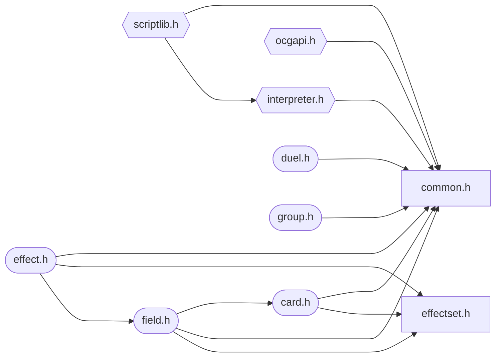
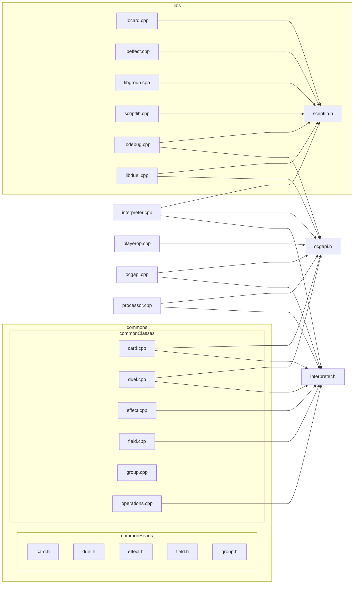
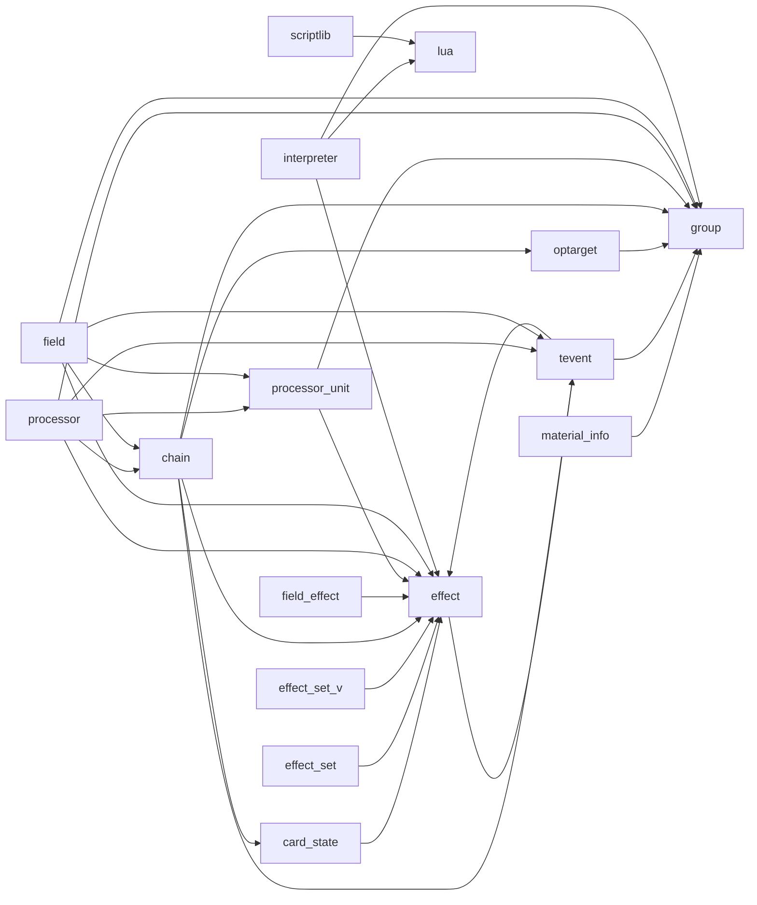
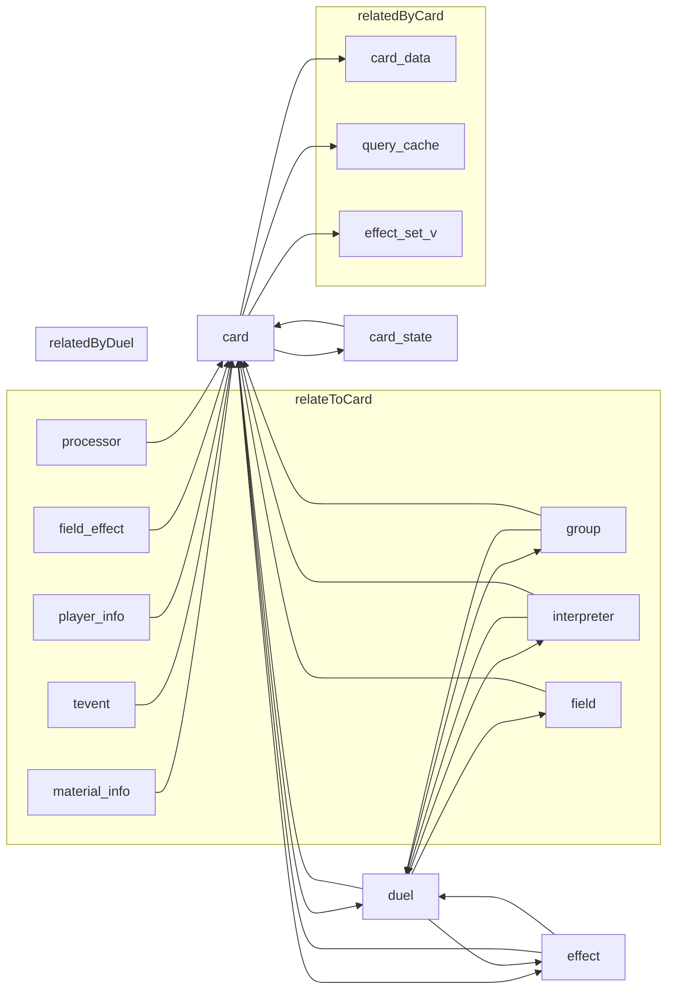

# About ocgcore

## File Dependencies of YGOCore

### Head Dependencies

```mermaid
flowchart LR

scriptlib.h{{scriptlib.h}}
interpreter.h{{interpreter.h}}
ocgapi.h{{ocgapi.h}}

card.h([card.h])
duel.h([duel.h])
effect.h([effect.h])
field.h([field.h])
group.h([group.h])

card.h ---> common.h
card.h ---> effectset.h
duel.h ---> common.h

effect.h ---> common.h
effect.h ---> effectset.h
effect.h ---> field.h

field.h ---> card.h
field.h ---> common.h
field.h ---> effectset.h

group.h ---> common.h

%% interpreter.h ---> lua.h
%% interpreter.h ---> lauxlib.h
%% interpreter.h ---> lualib.h
interpreter.h ---> common.h

ocgapi.h ---> common.h

scriptlib.h ---> common.h
scriptlib.h ---> interpreter.h
```

### Script Dependencies

```mermaid

flowchart LR
subgraph commons
    direction LR
    subgraph commonHeads
        card.h
        duel.h
        effect.h
        field.h
        group.h
    end
    subgraph commonClasses
        card.cpp 
        duel.cpp 
        effect.cpp 
        field.cpp 
        group.cpp 
        operations.cpp 
    end
end

effect.cpp ---> interpreter.h

field.cpp ---> interpreter.h

operations.cpp ---> interpreter.h

card.cpp ---> interpreter.h
card.cpp ---> ocgapi.h

duel.cpp ---> interpreter.h
duel.cpp ---> ocgapi.h


interpreter.cpp ---> interpreter.h
interpreter.cpp ---> ocgapi.h
interpreter.cpp ---> scriptlib.h

playerop.cpp ---> ocgapi.h
ocgapi.cpp ---> interpreter.h
ocgapi.cpp ---> ocgapi.h
processor.cpp ---> interpreter.h
processor.cpp ---> ocgapi.h


subgraph libs
    scriptlib.h

    libcard.cpp 
    libeffect.cpp 
    libgroup.cpp 
    scriptlib.cpp 
    libdebug.cpp 
    libduel.cpp 
end

libdebug.cpp ---> ocgapi.h
libdebug.cpp ---> scriptlib.h

libduel.cpp ---> ocgapi.h
libduel.cpp ---> scriptlib.h

libcard.cpp ---> scriptlib.h

libeffect.cpp ---> scriptlib.h

libgroup.cpp ---> scriptlib.h

scriptlib.cpp ---> scriptlib.h
```

### Class Dependences

```mermaid
flowchart LR

%% card.h
%%card_state --> card
card_state --> effect

%%material_info --> card
material_info --> group

%%card --> effect
%%card --> duel
%%card --> card_data
%%card --> card_state
%%card --> query_cache
%%card --> effect_set_v


%%duel --> card
%%duel --> interpreter
%%duel --> group
%%duel --> effect
%%duel --> field

%%effect --> duel
%%effect --> card
effect --> tevent

effect_set --> effect
effect_set_v --> effect

%% field
%%tevent --> card
tevent --> group
tevent --> effect

optarget --> group

chain --> card_state
chain --> effect
chain --> group
chain --> tevent
chain --> optarget

%%player_info --> card

field_effect --> effect
%%field_effect --> card

processor_unit --> effect
processor_unit --> group

processor --> effect
%%processor --> card
processor --> tevent
processor --> chain
processor --> processor_unit
processor --> group

field --> effect
%%field --> card
field --> tevent
field --> chain
field --> processor_unit
field --> group


%%group --> card
%%group --> duel

%%interpreter --> card
interpreter --> effect
interpreter --> group
%%interpreter --> duel
interpreter --> lua

scriptlib --> lua
```

只与 `duel` `card` 有关的依赖图:

```mermaid
flowchart LR
card --> duel
duel --> card

card_state --> card
card --> card_state

effect --> card
card --> effect

duel --> effect
effect --> duel

duel --> group
group --> duel

duel --> interpreter
interpreter --> duel

subgraph relateToCard
    material_info
    tevent
    player_info
    field_effect
    processor
    field
    group
    interpreter
end

subgraph relatedByCard
    card_data
    query_cache
    effect_set_v
end

subgraph relatedByDuel

end

material_info --> card
tevent --> card
player_info --> card
field_effect --> card
processor --> card
field --> card
group --> card
interpreter --> card

card --> card_data
card --> query_cache
card --> effect_set_v

duel --> field

```

- `card` `duel` `effect` 做接口
- 