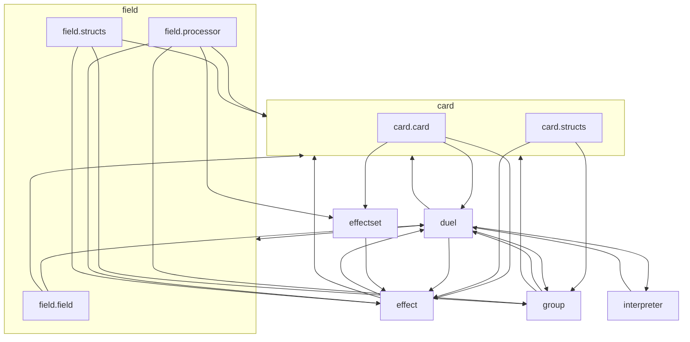
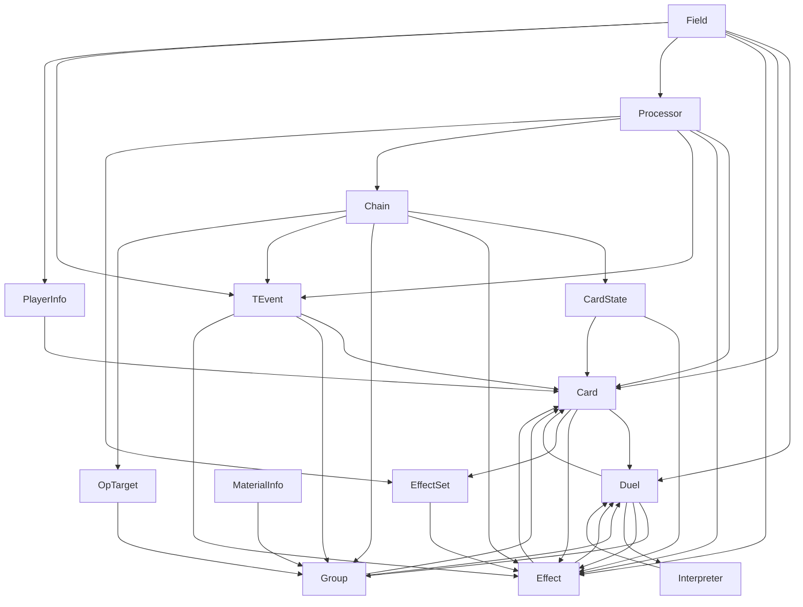

### Cycle Dependences

```mermaid
flowchart TB

subgraph card
    card.card
    card.structs
end

card.card ---> duel
card.card ---> effect
card.card ---> effectset

card.structs ---> effect
card.structs ---> group


duel ---> card
duel ---> effect
duel ---> field
duel ---> group
duel ---> interpreter

effect ---> card
effect ---> duel

effectset ---> effect

subgraph field
    field.field
    field.processor
    field.structs
end

field.field ---> card
field.field ---> duel

field.processor ---> card
field.processor ---> effect
field.processor ---> effectset
field.processor ---> group

field.structs ---> card
field.structs ---> effect
field.structs ---> group

group ---> card
group ---> duel

interpreter ---> duel
```

### Class Dependences

```mermaid
flowchart TB

Card ---> Duel
Card ---> Effect
Card ---> EffectSet

CardState ---> Effect
CardState ---> Card

MaterialInfo ---> Group

Duel ---> Card
Duel ---> Group
Duel ---> Effect
Duel ---> Interpreter

Effect ---> Card
Effect ---> Duel

EffectSet ---> Effect

Field ---> Duel
Field ---> Card
Field ---> Effect
Field ---> Processor
Field ---> TEvent
Field ---> PlayerInfo

Processor ---> Card
Processor ---> Effect
Processor ---> TEvent
Processor ---> Chain
Processor ---> EffectSet

TEvent ---> Card
TEvent ---> Group
TEvent ---> Effect

OpTarget ---> Group

Chain ---> CardState
Chain ---> Effect
Chain ---> Group
Chain ---> TEvent
Chain ---> OpTarget

PlayerInfo ---> Card

Group ---> Duel
Group ---> Card

Interpreter ---> Duel

```